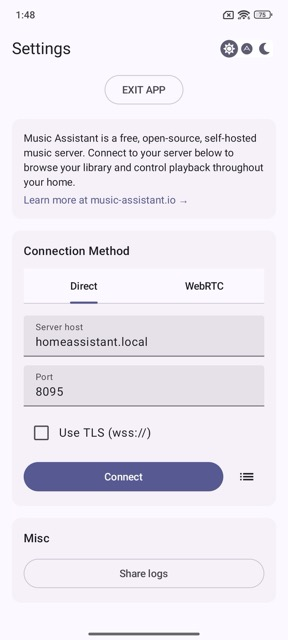

# Settings

After installing and opening the Music Assistant Mobile App, you'll be greeted with the settings screen. In here you can setup the app.

## Connection Method

The app supports two ways to connect to your Music Assistant server:

- **[Direct](connection-to-server-direct.md)** — Connect directly to your server over LAN (default) or via a manually setup remote connection.
- **[WebRTC](connection-to-server-webrtc.md)** — Connect using WebRTC, for easy remote connections without advanced setup.

> **Tip:** Tap the list icon (☰) next to the Connect button to manage or switch between saved connection configurations.

## Misc

| Option | Description |
|---|---|
| **Share logs** | Export and share the app's diagnostic logs. Useful for troubleshooting connection issues or reporting bugs. |

## Additional Options

The top-right toolbar provides quick access to:

- **Light mode** — Use app in light theme.
- **Auto** — Auto select theme based on device settings.
- **Dark mode** — Use app in dark theme.

To close the app entirely, tap **EXIT APP** at the top of the screen.

