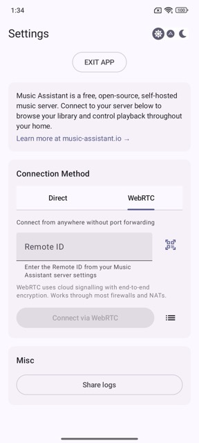
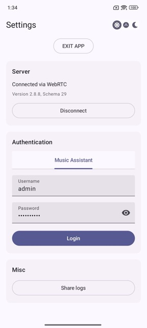

# Connect to Server using WebRTC

WebRTC allows you to securely connect the Music Assistant App to your Music Assistant server from anywhere in the world without advanced setup.

To connect to your Music Assistant server using WebRTC, make sure the <a href="https://www.music-assistant.io/settings/remote-access/" target="_blank">Remote Access Settings on your Music Assistant Server</a> are configured correctly.

## Fill in the fields

| Field | Description |
|---|---|
| **Remote ID** | The Remote ID of your Music Assistant server e.g. `G7M5K9LM-1SXVF-NVAL6-F3S7BV36`*. You can also use the QR code scanner to auto fill the Remote ID. |

\* `G7M5K9LM-1SXVF-NVAL6-F3S7BV36` is a fake generated Remote ID, be sure to fill in your personal Remote ID.

Once your Remote ID is filled in, tap **Connect via WebRTC** to move on to the next step.

## Authentication

After connecting, you will be asked to sign in.

| Authentication method | Description |
|---|---|
| **Music Assistant** | Sign in with the username and password of a Music Assistant user. |

Once signed in, you are ready to use the app.
