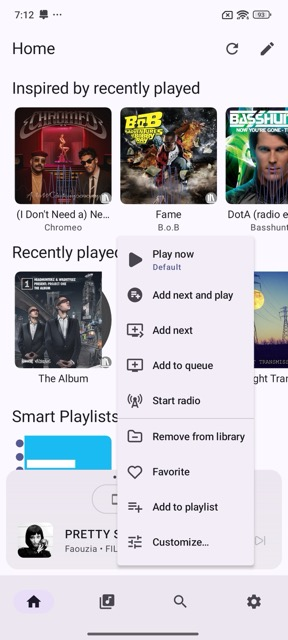
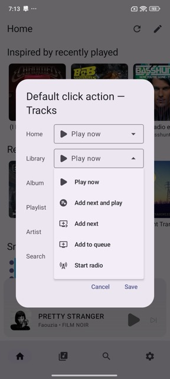

# Home

The Home tab is populated with data from the **Discover** view in Music Assistant. By default, it loads all sections that appear in Discover, excluding the MA frontend Player Bar section and folder sections.

The Music Assistant App provides its own [Players Pager](players-pager.md) for interacting with your Music Assistant players.

## Refreshing Home

Tap the **refresh icon** in the top right corner to refresh the Home tab. This pulls the latest Discover data from your Music Assistant server.

## Customizing Home

You can personalize the Home tab by tapping the **pencil icon** in the top right corner. From here you can:

- **Hide sections** — Remove sections you don't want to see on Home.
- **Reorder sections** — Drag sections into the order that works best for you.

Changes apply immediately and are saved per device.

## Interacting with Items

Tapping an item opens its [item details page](item-details.md). For single items such as tracks or radio stations, the default tap action is **Play Now**, which replaces the current queue and starts playing immediately.

Long-pressing an item opens a menu with additional actions. Available actions vary depending on the item type — for example, an album, audiobook, or podcast may each offer different options.

### Customizing default actions for single item clicks

The default action for single-item clicks can be customized per item type, so tracks, radio stations, and other items can each have their own default behavior.

To configure this, long-press any single item and tap **Customize...** at the bottom of the menu. This opens the **Default click action** settings, where you can set a different default action per context (Home, Library, Album, Playlist, Artist, and Search).

## Section Links

Some sections include a shortcut to the corresponding child [library](library.md). For example, tapping **All Albums** navigates to **Library › Albums**.