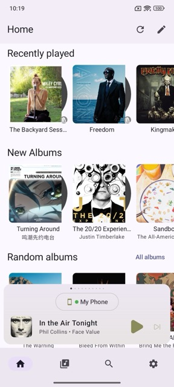
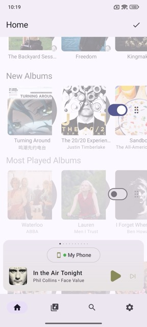
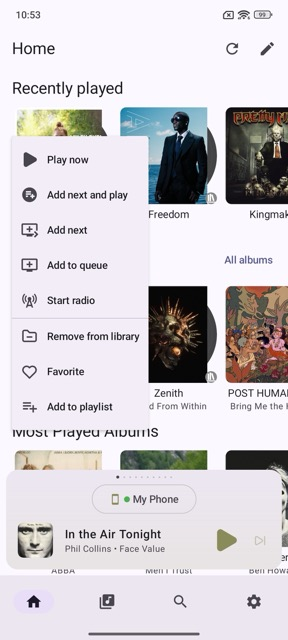

# Home

The Home tab is populated with data from the **Discover** view in Music Assistant. By default, it loads all sections that appear in Discover, excluding the MA frontend Player Bar section.

The Music Assistant App provides its own [Player Pager](player-pager.md) for interacting with your Music Assistant players.

## Refreshing Home

Tap the **refresh icon** in the top right corner to refresh the Home tab. This pulls the latest Discover data from your Music Assistant server.

## Customizing Home

You can personalize the Home tab by tapping the **pencil icon** in the top right corner. From here you can:

- **Hide sections** — Remove sections you don't want to see on Home.
- **Reorder sections** — Drag sections into the order that works best for you.

Changes apply immediately and are saved per device.

## Interacting with Items

Tapping an item opens its [item details page](item-details.md). For single items such as tracks or radio stations, tapping directly plays that item, replacing the current queue.

Long-pressing an item opens a context menu with additional actions such as **Play Now** and various queue options. Available actions vary depending on the item type — for example, an album, audiobook, or podcast may each offer different options.

## Section Links

Some sections include a shortcut to the corresponding child [library](library.md). For example, tapping **All Albums** navigates to **Library › Albums**.