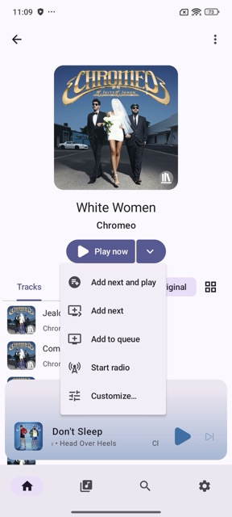
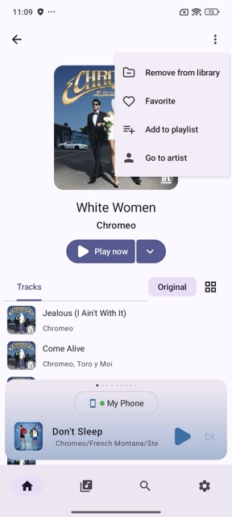
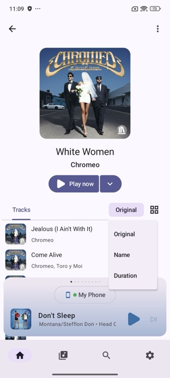
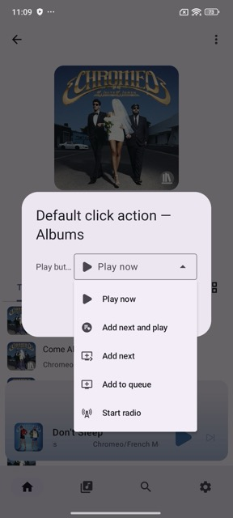

# Item Details

Tapping a parent item — such as an artist, album, podcast, or audiobook — from [Home](home.md), [Library](library.md), or [Global Search](global-search.md) opens its **item details** view. This view shows the item's artwork, title, and available actions. The exact details shown vary depending on the content type.

## Playing an Item

Tap the **Play now** button to replace the current queue and start playing the item immediately.

Tap the **dropdown arrow** next to **Play now** to reveal additional playback options such as:

- **Add next and play** — Insert the item next in the queue and start playing it immediately.
- **Add next** — Insert the item next in the queue without interrupting playback.
- **Add to queue** — Append the item to the end of the current queue.
- **Start radio** — Start a radio based on the item.
- **Customize...** — Configure the default click action for this item type (see [Customizing the Default Click Action](#customizing-the-default-click-action) below).

## Additional Actions

Tap the **three-dot menu** in the top right corner to access additional actions for the item. Available actions vary depending on the content type you are viewing.

## Tracks, Episodes, or Chapters

The content listed in the details view depends on the type of item you are viewing — artists show albums and tracks, albums show tracks, podcasts show episodes, and audiobooks show chapters.

### Sorting

Tap the **sort order button** to change the order of items in the list. Available options vary by content type.

### Toggle View Type

Use the **grid icon** next to the sort order button to toggle between list and grid view.

## Customizing the Default Click Action

The default action when tapping an item can be customized per item type. Tap the **dropdown arrow** next to **Play now** and select **Customize...** to open the **Default click action** settings.

From here you can choose a different default action — such as **Play now**, **Add next and play**, **Add next**, **Add to queue**, or **Start radio** — that will apply whenever you tap an item of that type. Available options vary by content type.

