# Library

The **Library** tab contains your Music Assistant library — a database of music you have indicated you want to listen to on a regular basis.

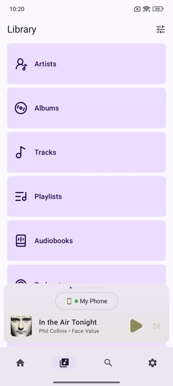

## Customizing the Library

You can customize the **Library** tab by tapping the **Tune icon** in the top right corner. From here you can:

- **Hide Library Items** — Remove items you don't want to see in the Library tab.
- **Reorder Library Items** — Drag items into the order that works best for you.

Changes apply after clicking **Done** and are saved per device.

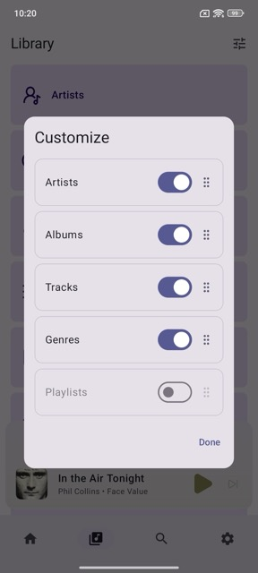

## Interacting with Your Library

From the **Library** tab, you can navigate into a child library (e.g. Albums) to browse and interact with items of that type. Here you will find all items of that type in your library, along with options that vary depending on the child library you are in.

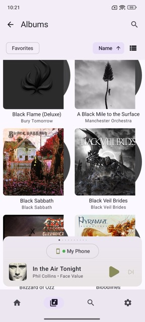

### Quick Search

Use the **Quick Search** field in the top right to search for items within that library.

If no items match your query, click **Search everywhere** to switch to [Global Search](global-search.md) — your query will be pre-filled and the appropriate filter(s) will be selected automatically based on the library type you initially searched from.

> **Example:** Searching for "eagles" from the Artists library will pre-fill "eagles" in Global Search and select the **Artists** filter.

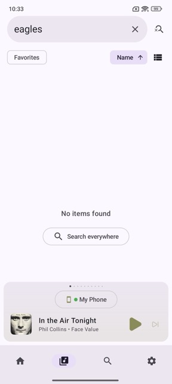
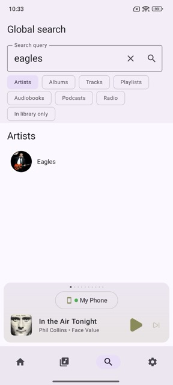

### Filter Favorites

Use the **Favorites** button to quickly filter your library items by favorite.

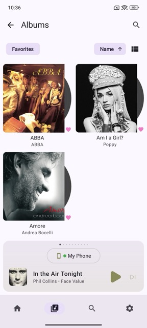

### Sort

Use the **Sort** button to sort items in the list. Available options vary depending on the child library you are currently in.

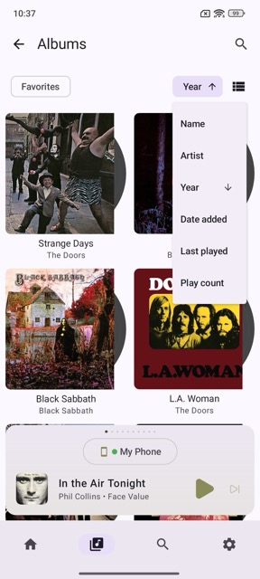

### Toggle View Type

Toggle between grid and list view. This preference is saved per content type.

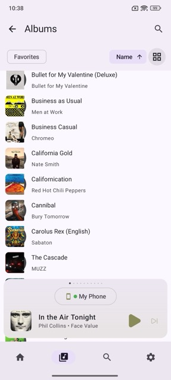

## Interacting with Items

Tapping an item opens its [item details page](item-details.md). For single items such as tracks or radio stations, the default tap action is **Play Now**, which replaces the current queue and starts playing immediately.

Long-pressing an item opens a menu with additional actions. Available actions vary depending on the item type — for example, an album, audiobook, or podcast may each offer different options.

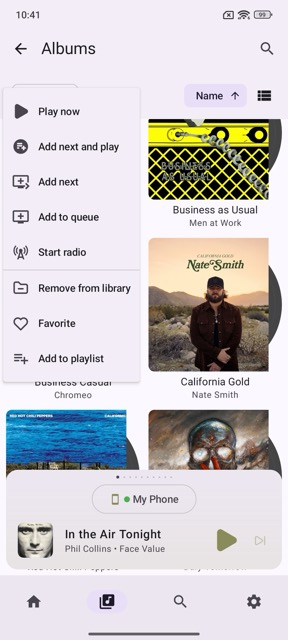

### Customizing default actions for single item clicks

The default action for single-item clicks can be customized per item type, so tracks, radio stations, and other items can each have their own default behavior.

To configure this, long-press any single item and tap **Customize...** at the bottom of the menu. This opens the **Default click action** settings, where you can set a different default action per context (Home, Library, Album, Playlist, Artist, and Search).

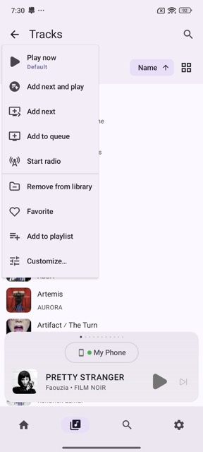
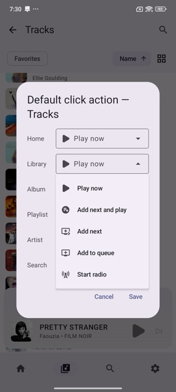