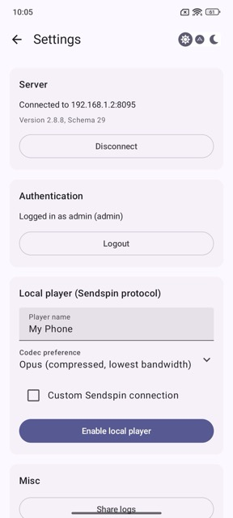
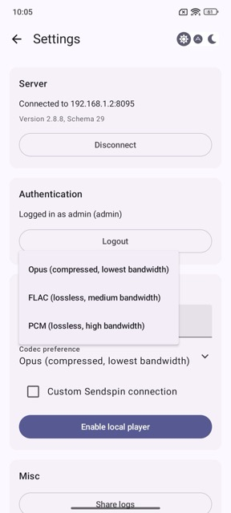
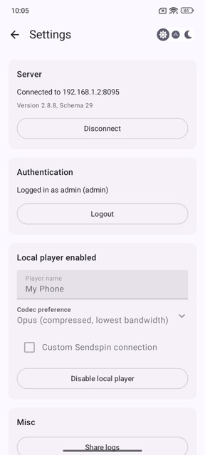
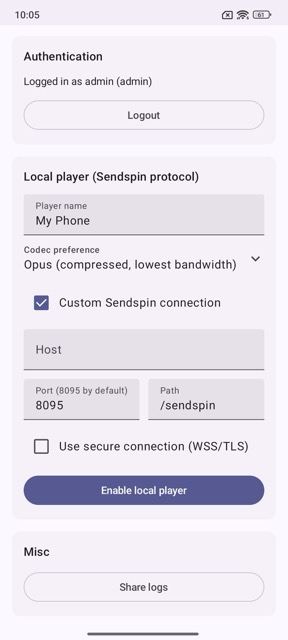

# Setting up the Local Player (optional)

You can use the app purely as a remote control for external players, with the local player disabled. Or you can configure it as a Sendspin client to play music directly through your device.

## Enabling the Local Player

In **Settings**, scroll to the **Local player (Sendspin protocol)** section.

Before enabling, configure the following options:

- **Player name** — The name that will appear in Music Assistant (default: My phone).
- **Codec preference** — The audio codec used for streaming. See [Codec Preference](#codec-preference) below.
- **Custom Sendspin connection** — Leave unchecked unless your setup requires a custom connection (see [Custom Sendspin Connection](#custom-sendspin-connection)).

Tap **Enable local player** to activate it. The section header will update to **Local player enabled**, and the button will change to **Disable local player**.

> **Good to know:** The Local Player is hidden by default in the Music Assistant Web UI, but visible under Music Assistant > Settings > Players as long as it is registered to the server. It registers automatically when the Local Player is enabled and the app is active and connected to the server. When the app is inactive, the player is de-registered and its settings are no longer editable.

## Codec Preference

The codec controls how audio is compressed and streamed from your Music Assistant server to the app. Choose based on your network conditions and how much audio quality matters to you.

- **Opus** *(Compressed, lowest bandwidth)* — A lossy format that uses the least data. Audio quality is good but not lossless. Best for mobile data connections, slower Wi-Fi, or when bandwidth is a concern.

- **FLAC** *(Lossless, medium bandwidth)* — Streams audio in full quality without any loss, using a moderate amount of bandwidth. Recommended over PCM for most setups — identical quality to PCM, with less network load.

- **PCM** *(Lossless, high bandwidth)* — Streams uncompressed, lossless audio but uses considerably more bandwidth than FLAC for identical quality. Only use this if your device or firmware has trouble playing FLAC files.

## Custom Sendspin Connection

If your Music Assistant server is not reachable via the default connection, enable **Custom Sendspin connection** to configure it manually.

| Field | Description |
|---|---|
| **Host** | The hostname or IP address of your Music Assistant server |
| **Port** | Port number (default: `8095`) |
| **Path** | Sendspin endpoint path (default: `/sendspin`) |
| **Use secure connection (WSS/TLS)** | Enable if your server uses a secure WebSocket connection |

## Car (Android Auto / CarPlay)

Once the Local Sendspin Player is enabled, the **Car Settings** section becomes available. Here you can configure how the app behaves when used in Android Auto or Apple CarPlay:

- **Tabs** — Customize which tabs are shown and in what order they appear.
- **Item actions** — Set the default action performed when tapping different item types.
- **DSP presets** — Configure what happens to the DSP for the Local Player when the phone is connected to or disconnected from the car.

After setting up the Local Player, you can [start using the app](home.md).