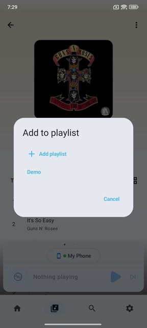
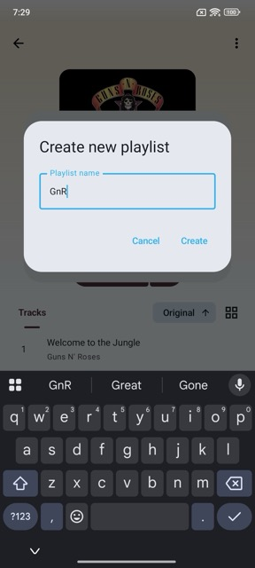

# Managing Playlists

> **Note:** Creating and configuring Smart Playlists is out of scope for the Mobile App. Smart Playlists can, however, be deleted from within the app.

Using the Mobile App, you can add an item to a **playlist**. This can be done via the long-press menu, or via the **⋮ (3-dot) menu** in the item details or player view. A new playlist can be created either from within the **Playlists** child library, or directly from the **Add to Playlist** dialog.

## Adding an Item to a Playlist

When adding an item to a playlist, you can select any editable playlist already in your library.

## Creating a New Playlist

If no editable playlist is available, select the **Add playlist** option to open the dialog for creating a new playlist.

A playlist is always created on the **Music Assistant** built-in provider. This allows the playlist to combine content from multiple music providers — so a single playlist can contain items from, for example, **Spotify**, **Tidal**, and a local library such as an **SMB/CIFS** or **NFS** share.

